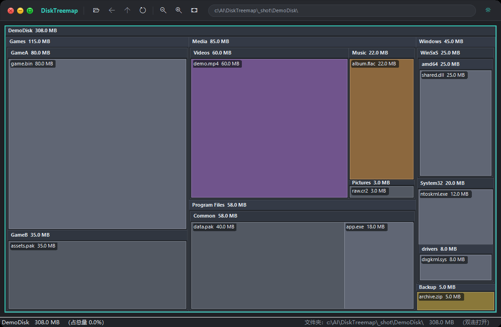

# DiskTreemap

A fast, single-file disk-usage treemap viewer for Windows — a lightweight
alternative to SpaceSniffer. Pick a drive or folder, and it renders an
interactive squarified treemap you can drill into, with a right-click menu for
native file operations.

The whole app is one self-contained `.exe` built from a single C# file. No
browser, no local server, no runtime to install beyond what ships with Windows.

**English** · [简体中文](使用说明.md)



## Features

- **Native WinForms UI** — a single ~98 KB executable built from one source file,
  with no browser and no HTTP service involved.
- **SpaceSniffer-style picker** — on launch you choose a drive or a folder and an
  aggregation threshold, instead of scanning something immediately.
- **Parallel scanner** — walks the tree with `Parallel.ForEach` (CPU x2 workers)
  and skips junctions / symlinks to avoid loops.
- **Small-file aggregation** — files below the threshold are collapsed into a
  single `(N small files)` node per folder, keeping the output legible.
- **Nested container view** — every folder is drawn as a labelled frame with a
  header bar, so the root drive and each level down are visually distinct.
- **Drill-down navigation** — double-click a folder cell to make it the new root;
  double-clicking a file jumps the view to the folder that holds it, and only
  opens the file when it already sits directly inside the current view. Back / up
  / path history are all available from the title bar.
- **Native context actions** — open, reveal in Explorer, properties, copy path or
  name, and move to the Recycle Bin (recoverable, never a hard delete).
- **Custom borderless window** — macOS-style traffic-light buttons, an integrated
  icon toolbar, a rounded path pill and rounded window corners.
- **Light / dark theme** — follows the Windows app theme automatically
  (`AppsUseLightTheme`, refreshed on `WM_SETTINGCHANGE`). A one-click toggle sits
  in the title bar, and a manual choice is remembered in
  `HKCU\Software\DiskTreemap` so it survives restarts.
- **Automatic English / Chinese UI** — the interface language follows the Windows
  display language (Chinese for `zh-*`, English otherwise). Every label, tooltip,
  menu and CLI message is localised.
- **DPI aware** — the process declares itself DPI aware so the UI is rendered at
  the native resolution instead of being bitmap-stretched on scaled displays.
- **Headless CLI mode** — scan to JSON without opening a window.

## Project layout

| File | Purpose |
| --- | --- |
| `DiskTreemap.cs` | The entire application: scanner, treemap layout, renderer, WinForms UI and CLI. |
| `build.ps1` | Compiles `DiskTreemap.cs` into `DiskTreemap.exe`. |
| `verify.ps1` | CLI acceptance suite (19 assertions). |
| `app.manifest` | Win32 manifest: `asInvoker`, supported OS list, DPI awareness. |
| `app.ico` | Multi-resolution application icon (16 / 32 / 48 / 64 / 256). |
| `docs/screenshot.png` | Application screenshot used in this README. |
| `README.md` | This file. |
| `使用说明.md` | End-user guide (Chinese). |
| `CHANGELOG.md` | Release history. |
| `CONTRIBUTING.md` | How to build, test and submit changes. |
| `SECURITY.md` | How to report a vulnerability. |
| `LICENSE` | MIT licence. |
| `.gitignore` | Ignores the build output (`*.exe`) and scratch files. |
| `.gitattributes` | Pins line endings to LF so checkouts are deterministic. |
| `.github/workflows/build.yml` | CI: builds the exe and runs the acceptance suite. |
| `.github/ISSUE_TEMPLATE/` | Issue templates. |

`DiskTreemap.exe` is a build artifact and is **not** committed — run `build.ps1`
to produce it, or grab the one attached to the latest release.

## Requirements

- **Windows 7 SP1 or later** (Windows 10 / 11 recommended). The UI is a WinForms
  application, so it needs the .NET Framework 4.x runtime — included with
  Windows 8 and later; on Windows 7, install .NET Framework 4.x first.
- **Building from source** needs only the C# compiler (`csc.exe`) that ships
  with the .NET Framework — no SDK, no Visual Studio, no NuGet restore.

## Build

```powershell
powershell -NoProfile -ExecutionPolicy Bypass -File build.ps1
```

Requires the .NET Framework 4.x C# compiler (`csc.exe`), which ships with
Windows. The script locates it automatically and prints the output size.

Run the acceptance suite afterwards:

```powershell
powershell -NoProfile -ExecutionPolicy Bypass -File verify.ps1
```

It builds a small fixture tree in `%TEMP%`, then checks the JSON output shape,
aggregation behaviour, argument handling and error exit codes.

CI runs `build.ps1` followed by `verify.ps1` on every push and pull request.

## Usage

Download the prebuilt `DiskTreemap.exe` from the
[latest release](https://github.com/yz7653886/DiskTreemap/releases/latest), or
build it yourself with `build.ps1`. Then run it to open the picker, or pass a
root to go straight to the viewer:

```powershell
.\DiskTreemap.exe                     # open the drive / folder picker
.\DiskTreemap.exe "C:\Users"
.\DiskTreemap.exe "D:\" --min 10485760
.\DiskTreemap.exe "D:\Projects" --out tree.json
.\DiskTreemap.exe --help
```

Options:

| Option | Meaning |
| --- | --- |
| `--out <file>` / `-o` | Scan only, write the JSON tree to a file and exit (no window). |
| `--min <bytes>` / `--min-file` | Aggregation threshold (default `1048576`). `0` disables aggregation. |
| `--help` / `-h` / `/?` | Show help. |

The exit code is `2` on a usage or scan error, `0` otherwise.

### Keyboard shortcuts

| Key | Action |
| --- | --- |
| `Backspace` | Go to the parent folder |
| `Alt` + `←` | Back (history) |
| `F5` | Rescan the current root |
| `Ctrl` + `C` | Copy the full path of the selected cell |

Mouse: drag to pan, wheel to zoom, double-click a folder cell to enter it,
double-click a file to open it when it already sits directly in the current
folder (otherwise the view jumps to the folder that contains it), and right-click
any cell for the native action menu. Drag any edge or corner of the borderless
window to resize it.

## Design notes

- **Squarified treemap** — `TreemapLayout.Squarify` lays children out by area
  while keeping aspect ratios near 1, so labels stay readable.
- **Sharp, shared edges** — cells use square corners and ~1 px borders so siblings
  sit flush against each other, SpaceSniffer style.
- **Two view scales** — entering a folder fills the viewport 1:1; *适应* (fit)
  drops to ~0.8 and centres the map for comfortable breathing room.
- **Labels degrade gracefully** — a cell is labelled `name  size`; when that does
  not fit, the size is dropped so the full folder name stays readable in narrow
  columns instead of being cut to `Reso…`.
- **Theme is centralised** — `Palette` holds a light and a dark colour set;
  `Theme` holds the accent colour and chrome colours. Switching the theme
  re-applies both to the canvas, toolbar renderer, status bar and menus.
- **Localisation** — one `Loc` table maps the Chinese source strings to English;
  the language is chosen once at startup from the Windows UI language, and any
  string without a translation falls back to Chinese.
- **DPI aware** — the process calls `SetProcessDPIAware()` and derives the treemap
  header height from the font metrics, so text stays sharp and unclipped on scaled
  displays.
- **Borderless resizing** — the docked children (title bar, canvas, status bar)
  return `HTTRANSPARENT` in the 6 px border zone so `WM_NCHITTEST` reaches the
  form and all eight resize directions work.

## Antivirus false positives

The binary is **not code-signed**, so a few heuristic / machine-learning engines
may flag a fresh build. Verdicts such as `ML.Attribute.HighConfidence`,
`Malicious.high.ml.score`, `Malicious (high Confidence)` or `*.susgen` are generic
ML scores aimed at new, unsigned, low-prevalence binaries — they do not name a
malware family. Compiled-on-demand tools that carry version info but no signature
tend to collect this kind of hit, and some engines are known for flagging freshly
compiled programs in general.

If you would rather not trust the prebuilt binary attached to a release, build
it yourself: the whole program is one C# file, and `build.ps1` needs nothing
beyond the compiler that ships with Windows. Each release also publishes a
SHA-256 checksum of the executable so you can verify the download.

## License

MIT — see [LICENSE](LICENSE).
